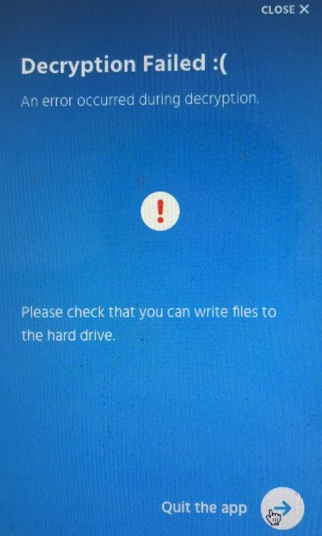

# I get the error "Decryption failed :("

## Problem

The exact text of the error is:

> Decryption failed :(
>
> An error occurred during decryption.
>
> Please check that you can write files to the hard drive.

The usual reason for that error is that you are trying to export a drive on a platform that cannot write to its filesystem, typically an NTFS drive on a Mac.

NTFS is a Microsoft filesystems and macOS cannot write to it by default. However, the export tool tries to export data in place, on the same USB drive it was on.

You can check that this is the issue by trying to write a file to the USB drive manually. If it fails, please read on. If you can write files to the USB drive, you have a different issue and should check the export tool logs.

## Solution

There are several ways to work around that issue.

The easiest one is to run the export tool on a Windows machine instead of a Mac, if you have access to one.

Another solution is to install a driver that lets macOS write to NTFS drives such as [Paragon NTFS](https://www.paragon-software.com/fr/home/ntfs-mac/). It is not free but as of now there is a free trial version available. Once installed, retry the export.

Yet another solution is to take another drive formatted in such a way that macOS can write to, such as HFS+. This drive should be large enough to fit all your data. Copy the whole `.lima` repository from the NTFS drive to the HFS+ drive, then unplug the NTFS drive and run the export on the new drive.

The last solution is to use the low-level command-line export tool to export to a different location (*documentation pending*).
